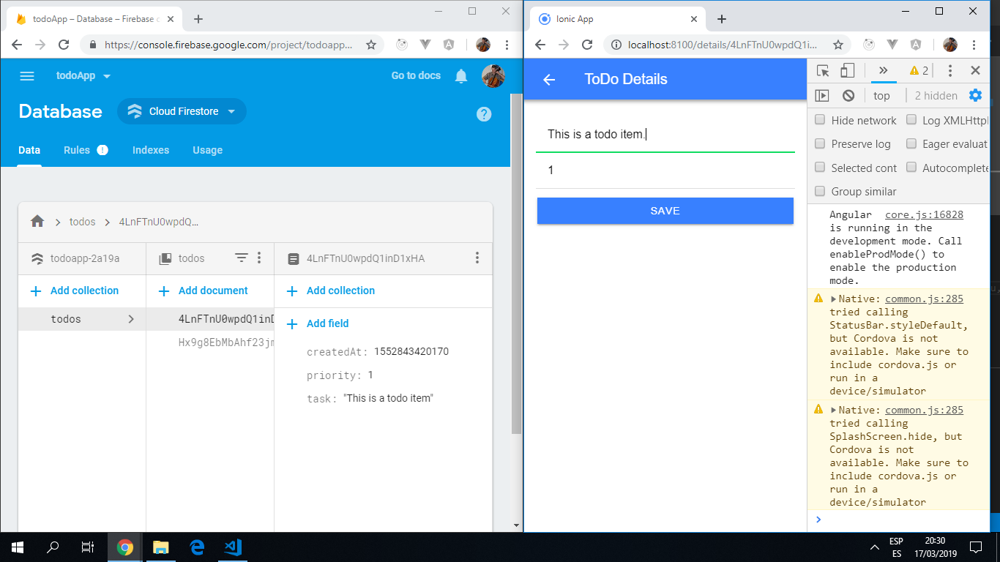

# :zap: Ionic Todo App

App created using the [Ionic 5 framework](https://ionicframework.com/docs), using a firebase cloud database to store to-do data. All CRUD operaations can be carried out using the Ionic UI.

## :page_facing_up: Table of contents

* [General info](#general-info)
* [Screenshots](#screenshots)
* [Technologies](#technologies)
* [Setup](#setup)
* [Features](#features)
* [Status](#status)
* [Inspiration](#inspiration)
* [Contact](#contact)

## :books: General info

* Note: Angular imports for Firestore are now from '@angular/fire/firestore'.
* Todos are passed to/from the firestore database as [observables](https://angular.io/guide/observables).

## :camera: Screenshots



## :signal_strength: Technologies

* [Ionic/angular v4.4.2](https://ionicframework.com/)
* [Ionic v5.7.0](https://ionicframework.com/)
* [Angular v8.0.0](https://angular.io/)
* [Firebase cloudstore v6.1.1](https://firebase.google.com/)

## :floppy_disk: Setup

* To start the server on _localhost://8100_ type: 'ionic serve'

## :computer: Code Examples

* It was necessary to clear the setting for the firestore timestampsInSnapshots in app.module.ts - see below.

```typescript
import { AngularFirestoreModule, FirestoreSettingsToken } from '@angular/fire/firestore';
@NgModule({
  declarations: [AppComponent],
  imports: [
     ...
     AngularFirestoreModule,
     ...
  ],
  providers: [{ provide: FirestoreSettingsToken, useValue: {} }],
  bootstrap: [AppComponent]
})
export class AppModule { }
```

## :cool: Features

**CRUD operations:**

* Create: Click '+' to create a to-do item.
* Read: Line items are displayed on the home page.
* Update: Click on item line to edit.
* Delete: swipe left and a coloured 'DONE' button appears on the right.

## :clipboard: Status & To-do list

* Status: Working.
* To-do: Add more detail/styling to front page.

## :clap: Inspiration

* Project inspired by [Simon Grimm´s Youtube video 'How to Create a Simple Ionic 4 App with Firebase and AngularFire'](https://www.youtube.com/watch?v=H20l9ofyR54&t=1375s)

## :envelope: Contact

* Repo created by [ABateman](https://www.andrewbateman.org) - feel free to contact me!
