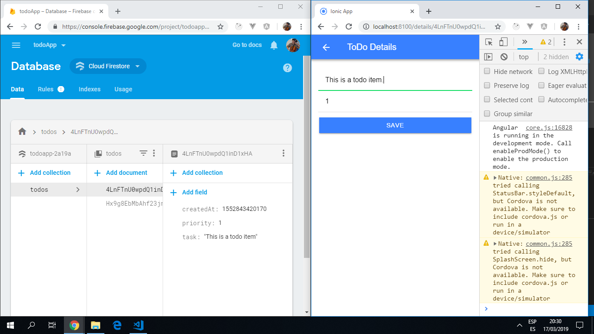
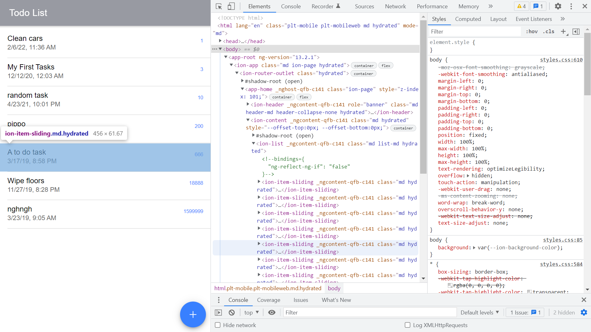

# :zap: Ionic Todo App

* App created using the [Ionic framework](https://ionicframework.com/docs), using a firebase cloud database to store to-do data.
* All CRUD operations can be carried out using the Ionic UI.
* **Note:** to open web links in a new window use: _ctrl+click on link_


## :page_facing_up: Table of contents

* [:zap: Ionic Todo App](#zap-ionic-todo-app)
  * [:page_facing_up: Table of contents](#page_facing_up-table-of-contents)
  * [:books: General info](#books-general-info)
  * [:camera: Screenshots](#camera-screenshots)
  * [:signal_strength: Technologies](#signal_strength-technologies)
  * [:floppy_disk: Setup](#floppy_disk-setup)
  * [:computer: Code Examples](#computer-code-examples)
  * [:cool: Features](#cool-features)
  * [:clipboard: Status & To-do list](#clipboard-status--to-do-list)
  * [:clap: Inspiration](#clap-inspiration)
  * [:file_folder: License](#file_folder-license)
  * [:envelope: Contact](#envelope-contact)

## :books: General info

* Note: Angular imports for Firestore are now from '@angular/fire/compat/firestore'.
* Todos are passed to/from the firestore database as [observables](https://angular.io/guide/observables).
* Todos are now sorted by priority using `this.todosCollection = db.collection<Todo>("todos", ref => ref.orderBy("priority"));` in `todo.service.ts`

## :camera: Screenshots




## :signal_strength: Technologies

* [Ionic/angular v6](https://ionicframework.com/)
* [Ionic v6](https://ionicframework.com/)
* [Angular v15](https://angular.io/)
* [Firebase cloudstore v9](https://firebase.google.com/)

## :floppy_disk: Setup

* `npm i` to install dependencies
* Add firebase access credentials in `environment.ts`
* To start the server on _localhost://8100_ type: 'ionic serve'
* `npm run build` to create build artifacts in `www` folder

## :computer: Code Examples

* It was necessary to clear the setting for the firestore timestampsInSnapshots & add `merge: true` in `app.module.ts` to avoid errors - see below.

```typescript
import { AngularFirestoreModule, FirestoreSettingsToken } from '@angular/fire/firestore';
@NgModule({
  declarations: [AppComponent],
  imports: [
     ...
     AngularFirestoreModule,
     ...
  ],
  providers: [{ provide: FirestoreSettingsToken, useValue: { timestampsInSnapshot: true, merge: true } }],
  bootstrap: [AppComponent]
})
export class AppModule { }
```

## :cool: Features

**CRUD operations:**

* Create: Click '+' to create a to-do item.
* Read: Line items are displayed on the home page.
* Update: Click on item line to edit.
* Delete: swipe left and a coloured 'DONE' button appears on the right.

## :clipboard: Status & To-do list

* Status: Working.
* To-do: Add more detail/styling to front page. Add ESLint. Limit priority number to `1 to 10`

## :clap: Inspiration

* Project inspired by [Simon Grimm´s Youtube video 'How to Create a Simple Ionic 4 App with Firebase and AngularFire'](https://www.youtube.com/watch?v=H20l9ofyR54&t=1375s)

## :file_folder: License

* This project is licensed under the terms of the MIT license.

## :envelope: Contact

* Repo created by [ABateman](https://github.com/AndrewJBateman), email: gomezbateman@yahoo.com
